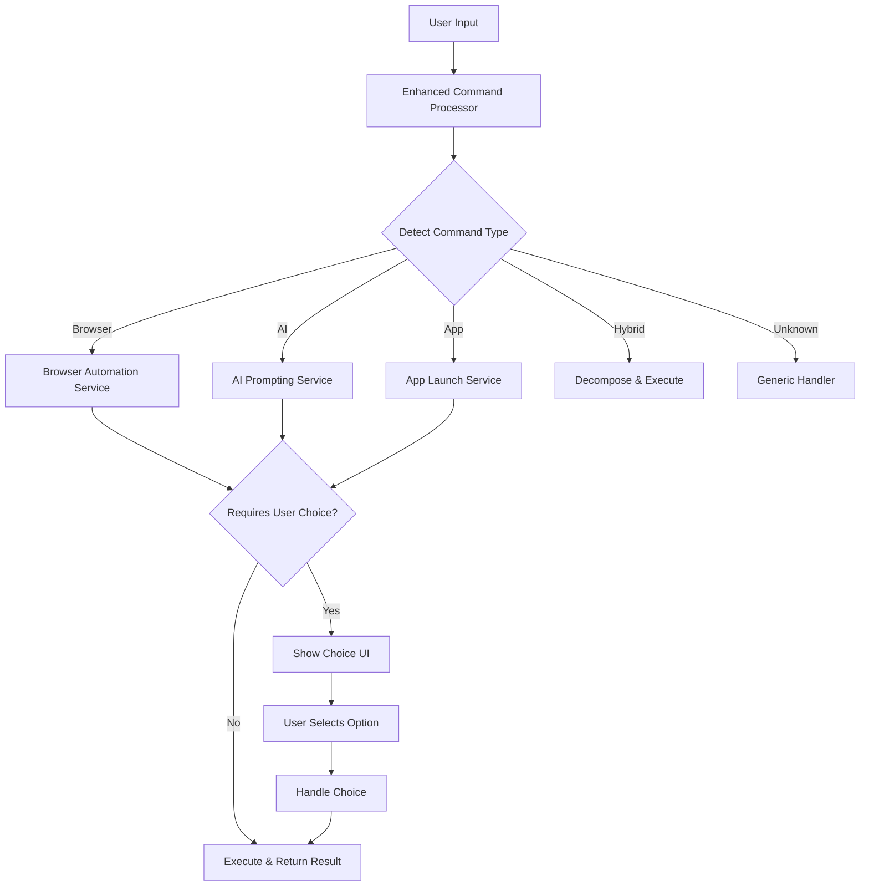

# Enhanced AI Assistant Implementation Guide

## Overview

This guide documents the comprehensive enhancements made to the desktop AI assistant, transforming it into an intelligent, context-aware system with advanced browser automation and AI prompting capabilities.

## 🚀 Key Enhancements

### 1. 🔧 Enhanced Browser Automation Service

**File:** `src/main/services/EnhancedBrowserAutomationService.ts`

#### Features:
- **Intelligent Browser Detection**: Automatically detects installed browsers (Chrome, Edge, Firefox, Brave)
- **Graceful Fallbacks**: When requested browser isn't available, suggests alternatives
- **Natural Language Processing**: Understands commands like:
  - "Open YouTube and search for cooking videos"
  - "Log into Gmail and draft an email to Alex"
- **Puppeteer Integration**: Advanced automation for form filling and interactive tasks
- **Task Memory**: Remembers user preferences and successful workflows

#### Key Methods:
```typescript
// Process browser commands with intelligent routing
processBrowserCommand(input: string, context?: any): Promise<CommandResult>

// Handle user choices for fallback scenarios
handleUserChoice(originalInput: string, choice: string): Promise<CommandResult>

// Generate contextual prompt suggestions
generatePromptSuggestions(input: string, context?: any): SuggestionResult
```

#### Example Usage:
```typescript
// Browser not found scenario
const result = await enhancedBrowserAutomationService.processBrowserCommand("open chrome");
// Returns: { requiresUserChoice: true, choices: ["edge", "firefox"], message: "Chrome isn't installed. Should I open Edge instead?" }

// User choice handling
const choiceResult = await enhancedBrowserAutomationService.handleUserChoice("open chrome", "edge");
// Executes the original command with Edge as the browser
```

### 2. 🧠 Enhanced AI Prompting Service

**File:** `src/main/services/EnhancedAIPromptingService.ts`

#### Features:
- **Context-Aware Suggestions**: Generates suggestions based on user role, app context, and recent tasks
- **Short-Term Memory**: Remembers recent commands and user patterns
- **Smart Templates**: Pre-built templates for common workflows
- **Role Detection**: Automatically detects user role (developer, PM, student, designer)
- **Intent Inference**: Understands vague commands like "do the thing I did yesterday"

#### Smart Templates:
```typescript
const templates = [
  {
    name: 'Email Summary',
    template: 'Summarize this [document_type] for [audience]',
    category: 'email'
  },
  {
    name: 'Meeting Actions',
    template: 'Generate action items from this [meeting_notes/screen_content]',
    category: 'productivity'
  },
  {
    name: 'Code Review',
    template: 'Review this [code_snippet] for [review_focus]',
    category: 'development'
  }
];
```

#### Contextual Suggestions:
```typescript
// Role-based suggestions for developers
if (userRole === 'developer' && input.includes('code')) {
  suggestions.push(
    'Would you like me to help debug this code?',
    'Should I suggest a refactoring approach?',
    'Do you need help writing tests for this?'
  );
}
```

### 3. 🎯 Enhanced Command Processor

**File:** `src/main/services/EnhancedCommandProcessor.ts`

#### Features:
- **Intelligent Command Routing**: Automatically routes commands to appropriate services
- **Hybrid Command Support**: Breaks down complex commands into multiple steps
- **Context Preservation**: Maintains context across command chains
- **Fallback Decision Trees**: Comprehensive fallback strategies

#### Command Types:
```typescript
type CommandType = 
  | 'browser_automation'  // Browser-related commands
  | 'ai_prompting'        // AI assistance commands
  | 'app_launch'          // Application launch commands
  | 'hybrid'              // Multi-step commands
  | 'generic';            // Fallback for unknown commands
```

#### Hybrid Command Example:
```typescript
// Input: "research and summarize the latest AI trends"
// Decomposed into:
// 1. "search for latest AI trends"
// 2. "summarize the findings about latest AI trends"
```

### 4. 🎨 Enhanced UI Component

**File:** `src/renderer/components/EnhancedCommandInput.tsx`

#### Features:
- **User Choice Interface**: Beautiful UI for handling fallback scenarios
- **Smart Template Display**: Visual template selection with categories
- **Real-time Suggestions**: Contextual suggestions as user types
- **Command History**: Persistent history with success/failure indicators
- **Performance Mode**: Optimized for resource-constrained environments

#### UI Components:
- **User Choice Panel**: Blue-themed panel for browser/app selection
- **Smart Templates**: Purple-themed template cards with descriptions
- **Suggestions**: Yellow-themed suggestion buttons
- **Status Indicators**: Real-time processing status with animations

## 🔄 Integration Flow

### 1. Command Processing Flow



### 2. Fallback Strategy

```typescript
// Browser fallback example
if (!browser.isInstalled) {
  const fallbackChoices = availableBrowsers
    .filter(b => b.name !== requestedBrowser)
    .map(b => b.name);
  
  return {
    success: false,
    message: `${requestedBrowser} isn't installed. Should I open ${fallbackChoices[0]} instead?`,
    requiresUserChoice: true,
    choices: fallbackChoices,
    fallbackStrategy: 'alternative_browser'
  };
}
```

## 📊 Metrics & Analytics

### 1. Task Memory Tracking

```typescript
interface TaskMemory {
  id: string;
  task: string;
  browser: string;
  success: boolean;
  timestamp: number;
  fallbackUsed?: string;
  userFeedback?: string;
}
```

### 2. Performance Metrics

- **Success Rate**: Track command execution success/failure
- **Fallback Usage**: Monitor how often fallbacks are used
- **User Choice Acceptance**: Track which suggestions users accept
- **Response Time**: Measure processing time for different command types

### 3. Usage Analytics

```typescript
// Example metrics collection
const metrics = {
  totalCommands: 150,
  successRate: 0.87,
  fallbackUsage: 0.23,
  averageResponseTime: 1.2,
  mostUsedBrowsers: ['edge', 'chrome', 'firefox'],
  popularTemplates: ['email_summary', 'meeting_actions']
};
```

## 🛠️ Configuration Options

### 1. Performance Mode

```typescript
// Ultra-lightweight mode for resource-constrained systems
const performanceConfig = {
  enableBrowserAutomation: false,
  enableAIPrompting: true,
  suggestionDebounce: 500,
  maxSuggestions: 3,
  disableAnimations: true
};
```

### 2. Browser Preferences

```typescript
// User browser preferences
const browserPreferences = {
  defaultBrowser: 'edge',
  fallbackOrder: ['edge', 'chrome', 'firefox', 'brave'],
  enablePuppeteer: true,
  headlessMode: false
};
```

### 3. AI Prompting Settings

```typescript
// AI prompting configuration
const aiPromptingConfig = {
  enableRoleDetection: true,
  enableSmartTemplates: true,
  maxMemoryEntries: 100,
  suggestionThreshold: 0.3,
  enableContextAwareness: true
};
```

## 🧪 Testing & Validation

### 1. Browser Detection Tests

```typescript
// Test browser detection on different platforms
describe('Browser Detection', () => {
  test('should detect Chrome on Windows', async () => {
    const browsers = await enhancedBrowserAutomationService.getAvailableBrowsers();
    expect(browsers).toContain('chrome');
  });
  
  test('should suggest fallbacks when browser not found', async () => {
    const result = await enhancedBrowserAutomationService.processBrowserCommand('open nonexistent-browser');
    expect(result.requiresUserChoice).toBe(true);
    expect(result.choices).toBeDefined();
  });
});
```

### 2. AI Prompting Tests

```typescript
// Test contextual suggestions
describe('AI Prompting', () => {
  test('should generate role-based suggestions for developers', async () => {
    const suggestions = enhancedAIPromptingService.generateContextualSuggestions(
      'debug this code',
      { userRole: 'developer' }
    );
    expect(suggestions).toContain('Would you like me to help debug this code?');
  });
  
  test('should detect incomplete commands', () => {
    const needsClarification = enhancedAIPromptingService.needsClarification('write email');
    expect(needsClarification).toBe(true);
  });
});
```

### 3. UI Component Tests

```typescript
// Test user choice handling
describe('Enhanced Command Input', () => {
  test('should display user choices when required', () => {
    render(<EnhancedCommandInput onClose={jest.fn()} />);
    // Simulate command that requires user choice
    fireEvent.change(screen.getByRole('textbox'), {
      target: { value: 'open chrome' }
    });
    fireEvent.submit(screen.getByRole('form'));
    
    expect(screen.getByText('Please choose an option:')).toBeInTheDocument();
  });
});
```

## 🚀 Deployment & Usage

### 1. Installation

```bash
# Install dependencies
npm install

# Build the enhanced services
npm run build

# Start in development mode
npm run dev

# Start in production mode
npm run start
```

### 2. Configuration

```typescript
// Initialize enhanced services
await enhancedBrowserAutomationService.initialize();
await enhancedAIPromptingService.initialize();
await enhancedCommandProcessor.initialize();
```

### 3. Usage Examples

```typescript
// Example 1: Browser automation with fallback
const result = await enhancedCommandProcessor.processCommand(
  "open chrome and search for AI trends"
);

// Example 2: AI prompting with context
const aiResult = await enhancedCommandProcessor.processCommand(
  "write a professional email to the team about the project update",
  { userRole: 'product_manager', appContext: 'gmail' }
);

// Example 3: Hybrid command
const hybridResult = await enhancedCommandProcessor.processCommand(
  "research and summarize the latest React features"
);
```

## 🔮 Future Enhancements

### 1. Advanced Automation
- **Playwright Integration**: More robust browser automation
- **Multi-browser Support**: Simultaneous browser control
- **Custom Automation Scripts**: User-defined automation workflows

### 2. AI Improvements
- **Local LLM Integration**: Offline AI processing
- **Voice Command Processing**: Advanced speech recognition
- **Predictive Suggestions**: ML-based command prediction

### 3. UI Enhancements
- **Dark Mode Support**: Complete dark theme
- **Customizable Themes**: User-defined color schemes
- **Accessibility Features**: Screen reader support, keyboard navigation

### 4. Integration Capabilities
- **API Integrations**: Connect to external services
- **Plugin System**: Extensible architecture for third-party plugins
- **Cloud Sync**: Synchronize settings and preferences across devices

## 📝 Troubleshooting

### Common Issues

1. **Browser Not Detected**
   - Check installation paths
   - Verify executable names
   - Ensure proper permissions

2. **Puppeteer Not Available**
   - Install puppeteer: `npm install puppeteer`
   - Check system dependencies
   - Verify Node.js version compatibility

3. **AI Service Errors**
   - Check API keys and configuration
   - Verify network connectivity
   - Review error logs for specific issues

### Debug Mode

```typescript
// Enable debug logging
process.env.DEBUG_MODE = 'true';

// Check service status
const browserStatus = enhancedBrowserAutomationService.getStatus();
const aiStatus = enhancedAIPromptingService.getStatus();
const processorStatus = enhancedCommandProcessor.getStatus();
```

## 📚 Additional Resources

- **API Documentation**: See individual service files for detailed API docs
- **Configuration Guide**: `CONFIGURATION.md` for advanced settings
- **Performance Guide**: `PERFORMANCE_GUIDE.md` for optimization tips
- **Testing Guide**: `TESTING_GUIDE.md` for comprehensive testing strategies

---

This enhanced AI assistant represents a significant leap forward in desktop automation and AI assistance, providing users with a powerful, context-aware, and user-friendly experience that adapts to their needs and preferences. 